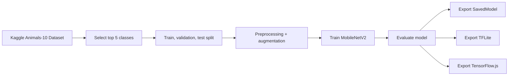

# Image Classification Project: Animals-10

Transfer learning image classification project built on the Kaggle Animals-10 dataset. The model selects the top 5 classes dynamically, trains a lightweight classifier, and exports the final result to SavedModel, TFLite, and TensorFlow.js.

[](https://www.tensorflow.org/)
[](https://github.com/kagglehub)


## Overview

This repository contains the final submission for an image classification project. The main notebook downloads the `alessiocorrado99/animals10` dataset through KaggleHub, normalizes the folder structure, and selects the 5 classes with the largest number of images. From there, the model is trained with a `tf.data` pipeline, data augmentation is applied only to the training split, and transfer learning is done with MobileNetV2.

The goal is to keep the project practical, reproducible, and easy to deploy. That is why the output is not limited to a TensorFlow model only. The project also exports TFLite and TensorFlow.js versions for mobile and web usage.

## Demo

No screenshot or GIF is included in this repository yet. As a quick visual summary, the workflow looks like this:



## Project Structure

```text
submission/
├── notebook.ipynb
├── notebook.py
├── README.md
├── requirements.txt
├── saved_model/
│   ├── fingerprint.pb
│   ├── saved_model.pb
│   └── variables/
├── tfjs_model/
│   └── model.json
└── tflite/
	├── label.txt
	└── model.tflite
```

## Prerequisites

- Python 3.10 or newer.
- Internet access to download the dataset with KaggleHub.
- Google Colab if you want to run the notebook exactly as it was originally prepared, because the notebook uses Google Drive for submission artifacts.
- `pip` for dependency installation.

## Installation

Install the dependencies first if you want to run the notebook locally:

```bash
pip install -r requirements.txt
```

If you use Google Colab, open `notebook.ipynb` and run the cells from top to bottom. The notebook handles dataset download, preprocessing, training, evaluation, and model export.

## Usage

To train and evaluate the model, open `notebook.ipynb` and execute the full notebook flow.

If you only want to load the exported model, use the format you need:

```python
import tensorflow as tf

model = tf.saved_model.load("saved_model")
```

For TFLite, use the files in the `tflite/` folder. For web deployment, use `tfjs_model/model.json`.

## Features

- Downloads the Animals-10 dataset through KaggleHub.
- Dynamically selects the top 5 classes from the available data.
- Splits the dataset into train, validation, and test sets.
- Applies augmentation only on the training split.
- Trains a MobileNetV2-based classification model.
- Evaluates the model with accuracy, confusion matrix, and classification report.
- Exports the final model to SavedModel, TFLite, and TensorFlow.js.
- Provides inference examples using internal test images and external image URLs in the notebook.

## Evaluation Results

The numbers below come from the latest run in `notebook.ipynb`:

| Split | Loss | Accuracy |
| --- | ---: | ---: |
| Train | 0.0032 | 0.9993 |
| Validation | 0.0982 | 0.9813 |
| Test | 0.0970 | 0.9837 |

## Contribution

If you want to improve this project, the workflow is straightforward:

1. Fork or copy the repository.
2. Make your changes in `notebook.ipynb` or `notebook.py`.
3. Rerun the notebook to confirm the results are still consistent.
4. Update the README if the training flow, dependencies, or exported artifacts change.

## License & Contact
 [MIT License](LICENSE).

Project owner contact:

- Name: Ahmad Meijlan Yasir
- Email: yasirahmad220504@gmail.com
- Dicoding ID: Ahmad Meijlan Yasir

## Notes

`notebook.py` is the exported script version of the main notebook. If there is any small difference between the two, `notebook.ipynb` remains the source of truth.
